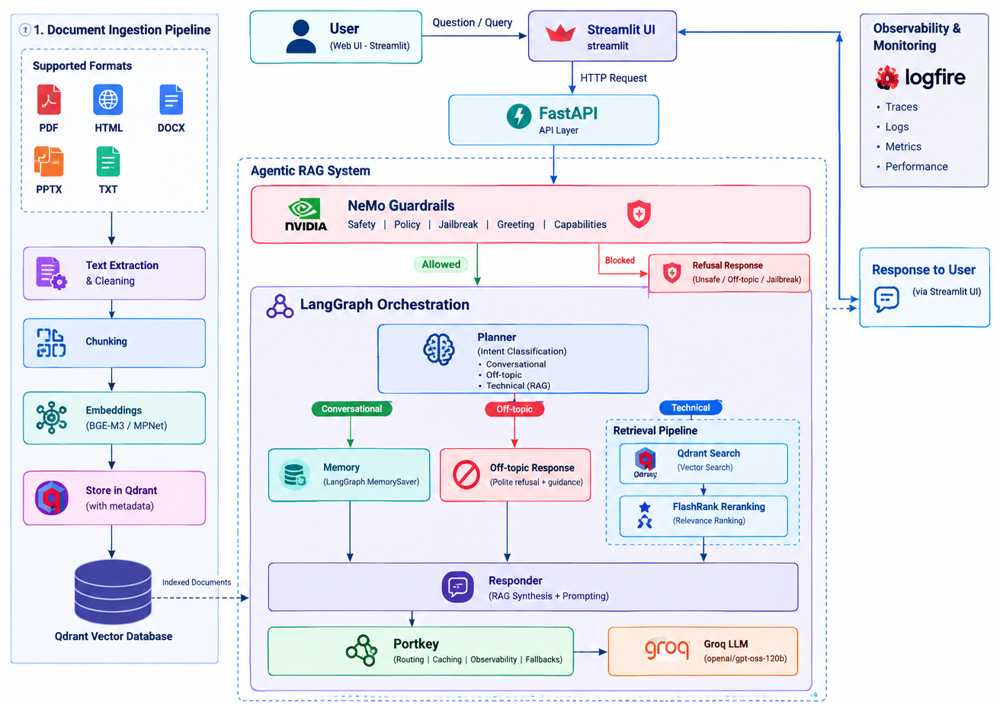
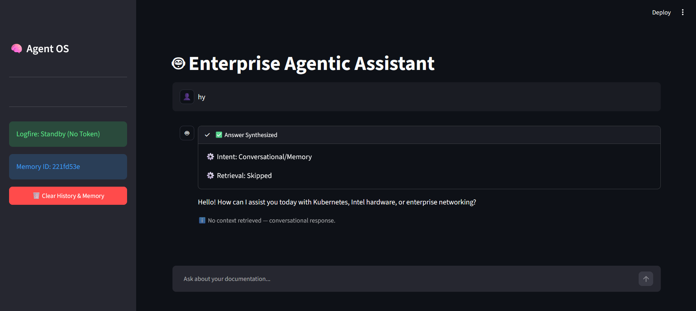
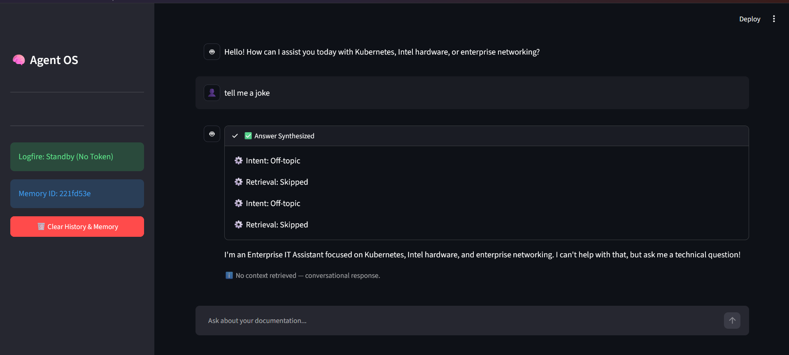
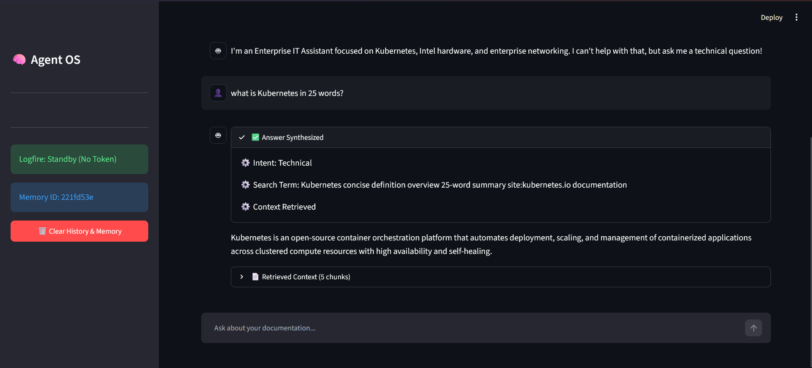

# Enterprise-Grade Agentic RAG Applications

A production-style enterprise Retrieval-Augmented Generation (RAG) system built with Python, LangGraph, FastAPI, Streamlit, Qdrant, and Portkey. The project is designed for technical support workflows focused on Kubernetes, Intel hardware, enterprise networking, and related infrastructure topics.

## Overview

This application demonstrates a complete end-to-end agentic RAG architecture:

- User chat UI in Streamlit
- FastAPI backend for orchestration
- NeMo Guardrails for policy and safety gating
- LangGraph planner + retriever + responder flow
- Qdrant vector retrieval with reranking
- Portkey gateway for routing, retries, cache, and observability
- Groq-hosted LLMs used behind the gateway

The system is intended for enterprise IT use cases and is built around a structured multi-step pipeline:




## Core Features

- Intent-aware planner for conversational vs technical requests
- Off-topic refusal flow for unsupported domains
- Guardrail enforcement for safety, jailbreak prevention, and capability boundaries
- Retrieval from Qdrant using vector search on technical documents
- Docs reranking and context assembly before synthesis
- Portkey-managed fallback, retry, caching, and observability
- Session memory through LangGraph checkpointing
- FastAPI backend with structured JSON responses
- Streamlit UI for demo and testing

## Architecture Summary

### 1. Frontend

- `ui/app.py` contains the Streamlit interface
- The UI sends requests to the FastAPI backend and displays the answer plus source docs

### 2. Backend

- `app/main.py` exposes `/query` and handles request lifecycle
- It runs the LangGraph agent and returns answer, sources, and status

### 3. Orchestration Layer

- `app/agents/graph.py` defines the workflow graph
- `app/agents/nodes/planner.py` decides whether a message is conversational, technical, or off-topic
- `app/agents/nodes/retriever.py` handles retrieval and reranking
- `app/agents/nodes/responder.py` produces final response with the docs context

### 4. Guardrails

- `app/guardrails/colang_rules.py` defines the Colang policies
- `app/guardrails/rails.py` initializes the NeMo guardrail layer and decides whether to block the request

### 5. Retrieval and Vector Store

- `app/services/retrieval/` contains retrieval logic and Qdrant integration
- `processed_data/` contains processed embeddings and chunk metadata

### 6. Gateway Integration

- `app/gateway/client.py` contains Portkey and LangChain integration logic
- `app/config.py` exposes environment-based configuration

## Project Structure

```text
.
├── app/                                 # Backend and core RAG application code
│   ├── agents/                          # Planner, retriever, responder, and workflow
│   ├── config.py                        # Loads application settings and environment variables
│   ├── gateway/                         # Portkey and LLM provider integration
│   ├── guardrails/                      # Safety policies and request checks
│   ├── ingestion/                       # Loads, processes, and chunks source documents
│   ├── main.py                          # FastAPI application and API routes
│   └── services/                        # Retrieval and supporting application services
├── DATA/                                # Source documents used by the project
│   ├── noisy_data/                      # Distractor or lower-relevance documents
│   └── true_data/                       # Relevant documents for answering questions
├── DOCS/                                # Detailed architecture, setup, and feature guides
│   ├── 01_SYSTEM_OVERVIEW.md            # High-level system architecture
│   ├── 02_INGESTION_ENGINE.md           # Document ingestion and chunking
│   ├── 03_NODE_INTELLIGENCE.md          # Agent node behavior
│   ├── 04_TRACING_AND_OBSERVABILITY.md  # Logging, metrics, and traces
│   ├── 05_ENVIRONMENT_VARIABLES.md      # Environment variable reference
│   ├── 06_KNOWN_GOTCHAS.md              # Known issues and troubleshooting notes
│   ├── 07_FLASHRANK_RERANKING.md        # Retrieval reranking details
│   ├── 08_GUARDRAILS.md                 # Safety and policy checks
│   ├── 09_LLM_GATEWAY.md                # Portkey gateway configuration and usage
│   └── 10_EVALS.md                      # Evaluation approach and tests
├── notebooks/                    #      # Experiments, evaluations, and analysis
├── processed_data/                      # Processed document chunks and metadata
├── screenshots/                         # Screenshots of the app and its behavior
│   ├── 1.png                            # Project screenshot
│   ├── 2.png                            # Project screenshot
│   └── 3.png                            # Project screenshot
├── ui/                                  # Streamlit frontend
│   └── app.py                           # Chat interface for sending queries
├── .env.example                         # Template for required environment variables
├── README.md                            # Project overview and setup instructions
├── requirements.txt                     # Python dependencies
└── .gitignore                           # Files and folders Git should ignore
```

## Screenshots

### Screenshot 1



### Screenshot 2



### Screenshot 3



## Prerequisites

Before running the app, make sure you have:

- Python 3.11+
- A Groq API key
- A Portkey API key
- A Qdrant Cloud cluster or a local Qdrant setup
- A Google Gemini key if embeddings are being generated
- Optional Logfire and LangSmith tokens for observability

## Setup

### 1. Create a virtual environment

```bash
python -m venv .venv
```

On Windows PowerShell:

```powershell
.\.venv\Scripts\Activate.ps1
```

### 2. Install dependencies

```bash
pip install -r requirements.txt
```

### 3. Configure environment variables

Copy the example file:

```bash
copy .env.example .env
```

Then fill in your actual values. The main gateway-related variables are:

```env
GROQ_MODEL=openai/gpt-oss-120b
GROQ_API_KEY="your_groq_key"
GROQ_FALLBACK_API_KEY="your_second_groq_key"
PORTKEY_API_KEY="your_portkey_key"
PORTKEY_GATEWAY_CONFIG='{"strategy":{"mode":"fallback"},"cache":{"mode":"simple"},"retry":{"attempts":2,"on_status_codes":[429,503]},"targets":[{"provider":"@GROQ_SLUG","override_params":{"model":"openai/gpt-oss-120b"}},{"provider":"@GROQ_SLUG_2","override_params":{"model":"openai/gpt-oss-120b"}}]}'
GROQ_SLUG="your_portkey_groq_slug"
GROQ_SLUG_2="your_portkey_second_groq_slug"
```

> Important: `PORTKEY_GATEWAY_CONFIG` should be saved as a JSON string in `.env` and passed exactly as the app expects. The application reads it using `app/config.py` and then passes it into the Portkey client configuration.

## Portkey Gateway Config

This is the gateway config that should be kept in the app configuration when using fallback + retry + caching:

```json
{
  "strategy": {
    "mode": "fallback"
  },
  "cache": {
    "mode": "simple"
  },
  "retry": {
    "attempts": 2,
    "on_status_codes": [429, 503]
  },
  "targets": [
    {
      "provider": "@GROQ_SLUG",
      "override_params": {
        "model": "openai/gpt-oss-120b"
      }
    },
    {
      "provider": "@GROQ_SLUG_2",
      "override_params": {
        "model": "openai/gpt-oss-120b"
      }
    }
  ]
}
```

This gives you:

- fallback routing between two Groq-backed targets
- retry on transient rate limits and service outages
- simple response caching for repeated queries
- clean gateway-level observability and resilience

## Running the Project

### Start the backend

```bash
uvicorn app.main:app --reload --port 8000
```

### Start the UI

```bash
streamlit run ui/app.py
```

### Check the app

Open:

- Streamlit UI: `http://localhost:8501`
- FastAPI docs: `http://localhost:8000/docs`

## Typical Workflow

1. User enters a technical question in Streamlit
2. Guardrails inspect the request
3. Planner decides whether it is conversational, technical, or off-topic
4. If technical, the retriever fetches relevant docs from Qdrant
5. Reranker filters and ranks the context
6. The responder synthesizes a final answer using the retrieved context
7. Portkey handles gateway-level fallback, cache, and retry logic
8. The response is returned to the UI with status and source docs

## Important Notes

### Guardrails vs Planner

The system intentionally keeps a distinction between:

- `guardrails`: explicit safety/policy checks, greetings, bad prompts, jailbreak patterns
- `planner`: intent classification and routing in the agent workflow

This prevents duplicated logic and keeps the system easier to reason about.

### Gateway and provider behavior

The app is designed to use Groq models through Portkey. In other words:

- The business logic remains almost unchanged
- Portkey handles retries, routing, cache, and observability
- You can change provider behavior centrally without changing application code

## Troubleshooting

### 1. Portkey 400 or route errors

Check:

- `PORTKEY_API_KEY` is set
- `PORTKEY_GATEWAY_CONFIG` is valid JSON
- `GROQ_SLUG` and `GROQ_SLUG_2` are configured correctly in the Portkey dashboard
- The model selected is available in your Groq account

### 2. No retrieval results

Check:

- Qdrant endpoint and API key are valid
- The collection exists and has documents
- The ingestion pipeline has run successfully

### 3. Guardrail triggers unexpectedly

Review:

- `app/guardrails/colang_rules.py`
- `app/guardrails/rails.py`
- The specific prompt or message being passed in

### 4. UI shows no sources

Check the backend response payload and confirm the retrieved documents are still being returned from the agent state and final node.

## Current Production Enhancements

Already implemented and in use:

- structured JSON output from the planner for deterministic routing
- explicit `intent` state in the agent workflow
- dedicated off-topic refusal path in the graph
- stronger separation between guardrails and routing logic
- more formal evaluation harness for routing, safety, and quality
- richer Prometheus metrics and dashboards
- multi-agent decomposition for larger enterprise workflows
- better persistence and session analytics

## License

This project is intended for learning and enterprise prototype use. Please check the repository rules before public deployment or commercial distribution.

## Summary

This project is a working example of an enterprise-grade agentic RAG stack that combines:

- LLM safety and policy filtering
- agentic orchestration with LangGraph
- retrieval and reranking over a technical corpus
- gateway-level resilience and observability with Portkey
- real-world enterprise IT response generation

It is designed to be extensible, production-aware, and easy to reason about as a layered system.
